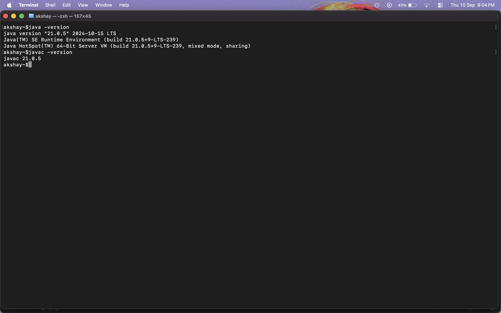
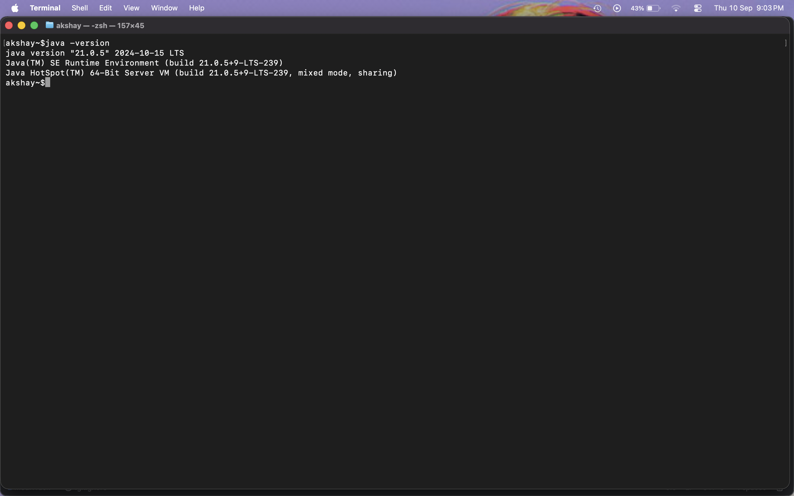

# MediTrack Java Setup

## Java version needed

MediTrack is a Maven project. The `pom.xml` file is set to compile the
project with Java 23:

```xml
<maven.compiler.source>23</maven.compiler.source>
<maven.compiler.target>23</maven.compiler.target>
```

A JDK is needed, not just a JRE. The JDK includes `javac`, which is used to
compile the source code.

## Installing Java

The screenshots were taken in a macOS Terminal. Install a JDK 23 version for
the Mac's processor. After installing it, check which JDK versions are
available:

```bash
/usr/libexec/java_home -V
```

If more than one JDK is installed, select Java 23 for the current terminal:

```bash
export JAVA_HOME=$(/usr/libexec/java_home -v 23)
export PATH="$JAVA_HOME/bin:$PATH"
```

To use this every time a new Terminal window is opened, add the same two
`export` lines to `~/.zshrc`, then open a new terminal.

On another operating system, install a JDK 23 distribution for that operating
system and add its `bin` directory to `PATH`.

## Checking the installation

Run these commands from Terminal:

```bash
java -version
javac -version
jar --version
mvn -version
```

The Java commands should show version 23. Maven should also show that it is
running with Java 23.

### Screenshot evidence



The Java screenshot shows:

```text
java version "21.0.5" 2024-10-15 LTS
javac 21.0.5
```

This confirms that Java and `javac` are installed, but the screenshot shows
Java 21, not the Java 23 version required by `pom.xml`.



The Maven screenshot only shows the Terminal prompt. It does not show the
result of `mvn -version`, so Maven's version and the Java version used by
Maven cannot be confirmed from this screenshot. A new screenshot with the
command output should be added after running it.

## Checking JAVA_HOME

`JAVA_HOME` should point to the JDK folder itself, not the `bin` folder.

On macOS:

```bash
echo "$JAVA_HOME"
"$JAVA_HOME/bin/java" -version
"$JAVA_HOME/bin/javac" -version
```

If the version from `JAVA_HOME/bin/javac` is different from `javac -version`,
the terminal is using a different JDK from the one selected in `JAVA_HOME`.

## Building and running MediTrack

From the project folder, run:

```bash
mvn clean package
```

If the build succeeds, run the compiled program with:

```bash
java -cp target/classes com.airtribe.Main
```

The project does not contain a Maven wrapper, so Maven must be installed
separately.

The starter class can also be compiled without Maven:

```bash
mkdir -p out
javac -d out src/main/java/com/airtribe/Main.java
java -cp out com.airtribe.Main
```

## Common problem

### `invalid target release: 23`

This error means that the selected `javac` is older than Java 23. Check the
version being used:

```bash
java -version
javac -version
mvn -version
```

Select JDK 23 using `JAVA_HOME` and `PATH`, then open a new Terminal window
and try the Maven command again.

## Setup checklist

- JDK 23 is installed.
- `java`, `javac`, and `jar` are available.
- `java -version` and `javac -version` show Java 23.
- `mvn -version` shows Maven running on Java 23.
- `JAVA_HOME` points to the JDK folder.
- `mvn clean package` completes successfully. 
- A screenshot showing the Maven version output is included.


